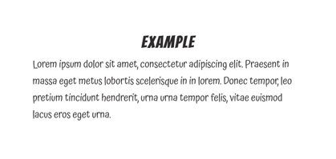
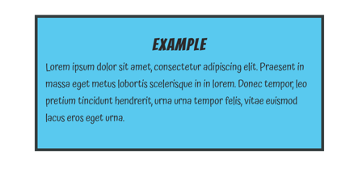
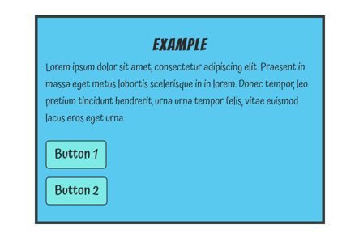
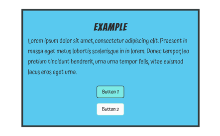

# Styling Guide

This app uses SCSS for styling. Ant Design components may be used where the functionality is needed, but we are moving away from using Ant Design for styling purposes.

## Specificity

The order of specificity is as follows:

### 1. Reset (reset.scss)

Removes and sets up some default styles, sets up 1rem:10px font-sizing, and border-box

### 2. Elements (elements.scss)

The default styling for elements. All styles for elements that have no class names are created here, with the exception of styles such as `.h2`, `.h3`.

### 3. Classes (classes.scss)

Reusable styles and secondary element styles. Any styles that can be used to modify an element in a way that's reusable on almost any page or in multiple React components should be declared here.

Examples of commonly-used class names:

- .content-box
- button.secondary
- button.small
- .bg-dark

### 4. Parent Styles (parent.scss)

These styles are meant to override the default game styles (the styles users will see while playing the game) with the styles the parent will tend to see, such as the login page, and the parent dashboard. Any `<div className="parent-styles">` that wraps a block of elements will change the styling of those elements to those of the "parent" styles. In some cases, small blocks of code can be wrapped with `.parent-styles`, not neccessarily an entire page.

> Note: please view the Figma file to determine where to use normal styles vs. .parent-styles (and for all other styling decisions, really).

### 5. Styled Components (components/ComponentName.scss)

These styles are used for individual components where more specific and non-reusable styles are required. Developers should opt for creating a component stylesheet when a reusable approach doesn't work.

**How To:**

- Create a stylesheet: `ComponentName.scss`
- Add the className of the component to the outermost element of the component: `<div className="component-name">`
- Add the className as the parent selector in the SCSS file: `.component-name { ... }`
- import the stylesheet into `index.scss` under the components section: `@import './components/ComponentName.scss';`

## Process

New styles should be primarily created in `classes.scss`, or if needed, as component stylesheets. Use caution when changing styles in `elements.scss`, but if you see a need to change the styles of all primary elements, then do so.

When creating new styles, ask yourself first: "can this style be used in other places in the app? Is this style something can can be generalized?" If the answer is "yes", or "probably", then you should opt to create a style in `classes.scss`. If the answer is "No, this is the only place in the app where this style applies." then you should opt to create a component stylesheet.

> Note: even if you are using a component stylesheet, you can still mix in `classes.scss` styles where they work. I.e., if you need to style a component with a stylesheet, but the component contains a button that looks like `button.small`, then don't write new styles for the button, just use `<button className="small">` in the component.

## Example

Let's say we have a new page and we want to add some content. According to our design specs (see Figma), most of our content is centered on the page, and much of it goes inside some kind of box.

Let's start with a div/section:

```html
<div className="content-box">
  <h2>Example</h2>
  <p>Lorem...</p>
</div>
```



This will add the content to a centered container with some padding and sizing, but the container isn't yet visible, so let's add some color and a border:

```html
<div className="content-box bg-blue border">
  <h2>Example</h2>
  <p>Lorem...</p>
</div>
```



Now our box has a blue background and a border.

Let's add two buttons:

```html
<div className="content-box bg-blue border">
  <h2>Example</h2>
  <p>Lorem...</p>
  <button>Button 1</button>
  <br />
  <button>Button 2</button>
</div>
```



Now I want to make sure the buttons are centered. They look a bit large also, and I want Button 1 to be the primary button, and Button 2 to be the secondary button.

I'll wrap the buttons in a div that will center them, and add the appropriate classNames to the buttons as well:

```html
<div className="content-box bg-blue border">
  <h2>Example</h2>
  <p>Lorem...</p>
  <div className="center-content">
    <button className="small">Button 1</button>
    <br />
    <button className="small secondary">Button 2</button>
  </div>
</div>
```


And there we have it. This is just one example of how we can combine reusable classNames to quickly create content. See more examples in the code.

## Semantic HTML

Always use the proper semantic tags for correct page heirarchy. If a `<p>` tag must look like an `<h2>` tag, use `<p className="h2">` if using a `<p>` tag is semantically appropriate. Don't use an `<h2>` tag just because that's the style you want. See the `elements.scss` stylesheet for class names that exactly match their element styles. More may be added if necessary.

## Future Iterations

This styling system is a work-in-progress and is open for changes and iterations as needed.

Some ideas include:
- Using a BEM naming system for a more organized naming convention
- Specifying game styles as their own group of styles, such that the parent styles and game styles both overwrite the default styles individually, rather than have the parent styles overwrite the game styles. This may help solve any future cascading/specificity issues (although no such issues have yet been encountered)
